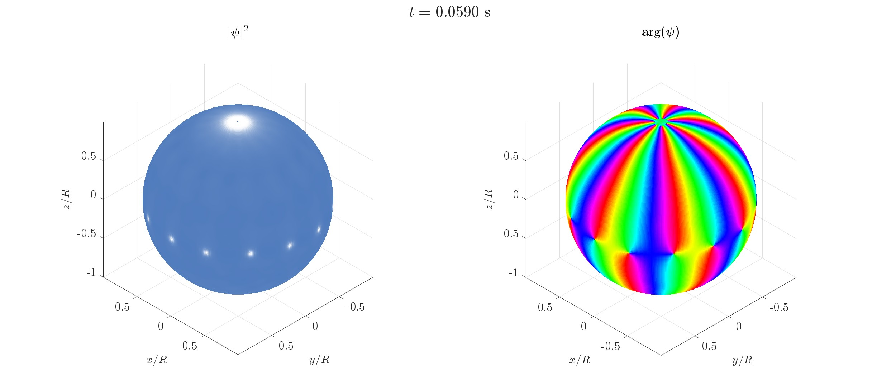

# Superfluid Kelvin–Helmholtz instability on a spherical shell

MATLAB code for the preparation, real-time Gross–Pitaevskii evolution, and post-processing of an equatorial vortex necklace and its Kelvin–Helmholtz-like instability on a spherical superfluid shell.

The code was developed for the numerical simulations reported in:

> M. Sorba and A. Richaud, *A magnetic monopole in a superfluid bubble* (2026).

The simulations describe a single-component Bose–Einstein condensate confined to a spherical shell. The initial state is prepared with counter-propagating azimuthal superflows in the northern and southern hemispheres, separated by an equatorial potential barrier. In the coordinate representation used by the code, the phase approaches +<i>qφ</i> in the northern hemisphere and −<i>qφ</i> in the southern hemisphere, with a smooth interpolation near the equator. This phase profile represents two like-charged polar vortices of winding number <i>q</i>, one at each pole. Lowering the barrier brings the two flows into contact and, in the simulated cases considered here, generates an equatorial necklace of 2<i>q</i> singly quantized vortices. The subsequent evolution is used to study the breakup of this quantized shear layer and its Kelvin–Helmholtz-like instability.

The released workflows study:

- the Gross–Pitaevskii dynamics for vortex charges <i>q</i> = 1,...,10;
- the formation and evolution of the equatorial vortex necklace;
- vortex trajectories on an equirectangular representation of the sphere;
- the growth of vortex-displacement modes;
- the dependence of the extracted instability growth rate on the imposed vortex charge.

<p align="center">
  
</p>

<p align="center">
  <em>Representative Gross–Pitaevskii evolution on a spherical superfluid shell at a time shortly after the equatorial barrier has been fully removed. The density (left) shows the depletions associated with the quantized vortices forming the equatorial necklace. The phase pattern (right) encodes the opposite azimuthal circulation imposed in the two hemispheres.</em>
</p>

## Repository structure

```text
superfluid-kelvin-helmholtz-instability-on-sphere/
├── run/
│   ├── run_sweep_vortex_charge.m
│   └── run_single_vortex_charge_case.m
│
├── src/
│   ├── ground_state/
│   ├── dynamics/
│   ├── diagnostics/
│   ├── visualization/
│   │   └── colormaps/
│   │       ├── oslo.txt
│   │       └── README.md
│   └── utilities/
│
├── postprocessing/
│   ├── create_charge_sweep_videos.m
│   ├── create_charge_sweep_comparison_videos.m
│   ├── track_vortices_on_equirectangular_map.m
│   └── estimate_instability_growth_rate.m
│
├── docs/
│   └── equatorial_vortex_necklace_dynamics.jpg
│
└── output/
```

The `run/` directory contains the simulation entry points. Numerical routines for initial-state preparation, real-time evolution, diagnostics, visualization, and spherical-grid operations are collected in `src/`. Analysis and video-generation scripts are provided in `postprocessing/`.

Simulation data, diagnostic figures, wavefunction snapshots, and rendered frames are written below `output/`. Generated output should not be tracked by Git.

## Requirements

The simulation code requires:

- MATLAB;
- MATLAB Parallel Computing Toolbox for the charge sweep, which uses `parfor`;
- the SSHT (Spin Spherical Harmonic Transform) MATLAB library.

Some post-processing workflows additionally require:

- MATLAB Image Processing Toolbox for Gaussian image filtering and image resizing;
- MATLAB Computer Vision Toolbox for text overlays in the comparison videos.

## SSHT dependency

This code explicitly relies on **SSHT: Fast spin spherical harmonic transforms**, developed by Jason McEwen and collaborators.

SSHT is an external dependency and is **not distributed with this repository**. The MATLAB version of SSHT must be installed separately and made available on the MATLAB path before running the simulations.

- [SSHT source repository](https://github.com/astro-informatics/ssht)
- [SSHT documentation](https://astro-informatics.github.io/ssht/)
- [SSHT project page](http://www.jasonmcewen.org/project/ssht/)

The present code calls the following SSHT routines:

```text
ssht_sampling
ssht_forward
ssht_inverse
ssht_plot_sphere
```

The simulation entry points automatically check that these functions are available on the MATLAB path.

The SSHT developers request that work resulting in publication reference the SSHT repository and cite the related academic papers:

J. D. McEwen and Y. Wiaux,  
*A novel sampling theorem on the sphere*,  
IEEE Transactions on Signal Processing **59**, 5876–5887 (2011).

J. D. McEwen, G. Puy, J.-Ph. Thiran, P. Vandergheynst, D. Van De Ville, and Y. Wiaux,  
*Sparse image reconstruction on the sphere: implications of a new sampling theorem*,  
IEEE Transactions on Image Processing **22**, 2275–2285 (2013).

SSHT is released separately under the GPL-3.0 license. Please consult the SSHT repository and documentation for installation and licensing details.

## Oslo colour map

The density visualization uses the **Oslo** colour map from the Scientific Colour Maps collection by Fabio Crameri.

The RGB table used by the released plotting workflow is bundled under:

```text
src/visualization/colormaps/oslo.txt
```

This local copy is included to make the visualization workflow reproducible and to preserve the colour mapping used in the reported simulations. The file is third-party material and is identified separately in:

```text
src/visualization/colormaps/README.md
```

Users should consult the original Scientific Colour Maps distribution for citation and licensing information:

- [Scientific Colour Maps](https://www.fabiocrameri.ch/colourmaps/)

## Running the charge sweep

The main simulation workflow is located in `run/`.

Run:

```matlab
run_sweep_vortex_charge
```

The default calculation uses:

```matlab
q_values = 1:10;
prepare_initial_states = true;
```

and the real-time parameters:

```matlab
params.T_slope               = 0.05;
params.dt_real               = 1e-6;
params.tmax_real             = 0.15;
params.sample_frequency_real = 1000;
params.l_filter_real         = 18;
```

For each value of <i>q</i>, the workflow:

1. initializes a two-patch phase profile approaching +<i>qφ</i> and −<i>qφ</i> in the northern and southern hemispheres, respectively;
2. prepares the barrier-separated initial state by imaginary-time evolution in the presence of the equatorial barrier and polar pinning potentials;
3. removes the polar pinning potentials;
4. lowers the equatorial barrier linearly over the time `T_slope`;
5. evolves the single-component Gross–Pitaevskii equation in real time;
6. saves diagnostics, Oslo-rendered JPEG frames, and wavefunction snapshots for vortex tracking.

Results are written to:

```text
output/Sweep_q/q_<value>/
```

For example:

```text
output/Sweep_q/q_8/
```

The prepared state for each case is stored as:

```text
Single_component_monopole_on_sphere.mat
```

The real-time workflow reads this file before starting the dynamics.

With the current default setting:

```matlab
prepare_initial_states = true;
```

the initial states are recomputed before the corresponding real-time evolutions. If `prepare_initial_states` is set to `false`, the prepared-state files must already exist in the case directories.

## Initial-state preparation

Initial states are generated by:

```matlab
Prepare_single_component_initial_state_sphere
```

The default physical and numerical parameters are defined in that routine unless they are supplied through the `params` structure. The default atom number is:

```matlab
N_a = 5e5;
```

Away from the equatorial interpolation region, the phase approaches:

```text
North:  +q phi
South:  -q phi
```

A smooth interpolation is used near the equator. The density in the equatorial region is simultaneously suppressed by the potential barrier, allowing the two hemispherical superflows to be prepared before they are brought into contact.

The prepared state is relaxed by imaginary-time Gross–Pitaevskii evolution and saved in the corresponding `q_<value>` directory.

## Real-time dynamics

Real-time evolution is performed by:

```matlab
Run_single_component_dynamics_sphere
```

The polar pinning potentials used during initial-state preparation are absent during the real-time dynamics. The equatorial barrier is lowered linearly to zero over `T_slope` and remains absent afterwards.

During the dynamics, the code records:

- simulation time;
- total Gross–Pitaevskii energy;
- wavefunction norm;
- instantaneous barrier amplitude;
- total angular momentum along the <i>z</i> axis.

The progress log reports the relative changes in energy and angular momentum with respect to the first sampled real-time state.

Rendered frames are written to:

```text
Temp_real_oslo/
```

Wavefunction snapshots used by the tracking workflow are written to:

```text
psi_a_vs_t/
```

The real-time diagnostic data are saved in:

```text
Real_time_dynamics_single_component_on_sphere_oslo.mat
```

## Running a single charge case

The convenience script:

```matlab
run_single_vortex_charge_case
```

reruns the real-time dynamics for one selected value of <i>q</i> with independently specified real-time parameters.

The default selected case is:

```matlab
q = 8;
```

This script is intended for regenerating a selected trajectory or visualization with custom evolution parameters. It is not a post-processing script.

The corresponding prepared state must already exist in:

```text
output/Sweep_q/q_<value>/Single_component_monopole_on_sphere.mat
```

before the real-time evolution is started.

## Post-processing

The `postprocessing/` directory contains four workflows.

### Charge-sweep videos

Run:

```matlab
create_charge_sweep_videos
```

The script scans the `q_*` output directories and creates one MPEG-4 video from the JPEG frames stored in each `Temp_real_oslo/` directory.

Cases without rendered frames are skipped.

### Comparison videos

Run:

```matlab
create_charge_sweep_comparison_videos
```

The script combines the <i>q</i> = 1,...,9 simulations into 3-by-3 comparison videos.

Two videos are produced:

- a density comparison using the left panel of each rendered frame;
- a phase comparison using the right panel of each rendered frame.

The script uses the saved time vector from the <i>q</i> = 1 simulation as the reference time axis and truncates all cases to the common number of available frames.

### Vortex tracking on an equirectangular map

Run:

```matlab
track_vortices_on_equirectangular_map
```

The script reads the saved wavefunction snapshots from `psi_a_vs_t/` and tracks the expected 2<i>q</i> density depletions associated with the equatorial vortex necklace.

Tracking starts from the first saved frame satisfying:

```matlab
t >= T_slope_ref
```

with the default value:

```matlab
T_slope_ref = 0.05;
```

Polar caps are excluded from density-hole detection. The density can be Gaussian-smoothed before local minima are identified, and vortex positions are matched between successive frames using the periodic azimuthal coordinate.

Tracking output is written below:

```text
output/Sweep_q/Postprocess_vortex_tracks_planisphere/
```

### Instability growth-rate analysis

Run:

```matlab
estimate_instability_growth_rate
```

This workflow uses the tracked vortex trajectories to analyse the growth of vortex-displacement modes.

For each charge <i>q</i>, the script constructs the complex vortex displacement and evaluates its discrete Fourier modes along the necklace. Since the necklace contains <i>N</i><sub>v</sub> = 2<i>q</i> vortices, the analysis focuses on the highest-wavenumber mode supported by the discrete ring, <i>m</i> = <i>N</i><sub>v</sub>/2 = <i>q</i>, and monitors the amplitude |<i>c</i><sub>q</sub>|.

The instability growth rate is extracted from a linear fit of log|<i>c</i><sub>q</sub>|. The fitting interval is selected automatically among contiguous candidate windows satisfying the amplitude and goodness-of-fit thresholds defined in the script.

The extracted quantities include:

- the fitted growth rate <i>σ</i><sub>*</sub>;
- the uncertainty of the linear-log fit;
- the dimensionless growth rate;
- the analysed mode index <i>m</i><sub>*</sub> = <i>q</i>;
- the fit interval and coefficient of determination;
- normalized growth-rate ratios used in the analysis.

The workflow exports diagnostic figures and displays a summary table in MATLAB.

The fit thresholds and diagnostic options are defined near the beginning of `estimate_instability_growth_rate.m` and can be adjusted before running the analysis.

## Numerical implementation

The Gross–Pitaevskii equation is evolved directly on a spherical grid.

Spherical sampling and spherical-harmonic transforms are handled using SSHT. The spherical-harmonic representation is used to evaluate the spherical Laplacian and to apply spectral filtering.

The workflow is divided into two stages:

- imaginary-time evolution for preparation of the barrier-separated initial state;
- real-time evolution while the equatorial barrier is removed.

The repository includes diagnostic routines for:

- total Gross–Pitaevskii energy;
- total angular momentum along the <i>z</i> axis.

Visualization routines provide both the standard spherical rendering and the Oslo-based density rendering used for the released frames.

## Output and data storage

Simulation output is written below the `output/` directory.

The real-time simulations can generate large MATLAB data files, many JPEG frames, and a sequence of wavefunction snapshots. These generated files are intended to remain outside version control.

The post-processing scripts read the generated simulation data and may create MPEG-4 videos, tracking files, diagnostic figures, and instability-analysis outputs.

## Citation

If you use this code in published work, please cite the associated publication:

> M. Sorba and A. Richaud, *A magnetic monopole in a superfluid bubble* (2026).

A citation for the archived software release and its DOI will be added after the corresponding public release is deposited.

Since this code uses SSHT for spherical harmonic transforms, users should also follow the referencing instructions provided by the SSHT developers and cite the relevant SSHT papers listed above.

The Oslo colour map originates from the Scientific Colour Maps collection by Fabio Crameri. Please follow the citation instructions associated with the original Scientific Colour Maps distribution.

## License

The original code in this repository is distributed under the GNU General Public License v3.0. See the `LICENSE` file for details.

SSHT is an external software dependency and is not included in this repository. SSHT is distributed separately under the GPL-3.0 license.

The bundled `oslo.txt` colour-map table is third-party material from the Scientific Colour Maps collection and is identified separately in `src/visualization/colormaps/README.md`. Its original attribution and licensing terms remain applicable.

## Contact

For questions concerning the simulations or numerical implementation, please contact:

**Andrea Richaud**  
Universitat Politècnica de Catalunya (UPC)